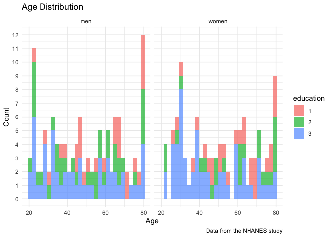
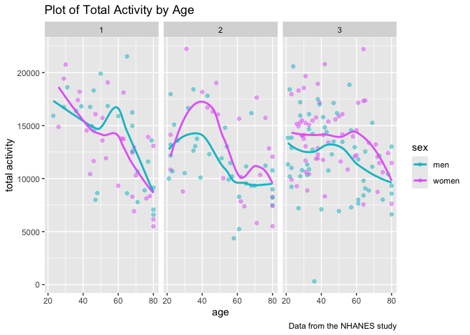

p8105_hw3_az2852
================

``` r
library(tidyverse)
library(lubridate)
library(patchwork)
library(viridis)
```

# Problem 1

``` r
library(p8105.datasets)
data("ny_noaa")
```

``` r
clean_ny_noaa = ny_noaa %>% 
  mutate(
    day = day(date),
    month = month(date),
    year = year(date)
  ) %>% 
  mutate(
    tmax = as.numeric(tmax),
    tmin = as.numeric(tmin),
    tmax_C = tmax/10,
    tmin_C = tmin/10,
    prcp_mm = prcp/10
  ) %>% 
  rename(
    snowfall_mm = snow,
    snow_depth_mm = snwd
  ) %>% 
  select(id, date, snowfall_mm, snow_depth_mm, day:prcp_mm)
```

### For snowfall, what are the most commonly observed values? Why?

``` r
clean_ny_noaa %>% 
  count(snowfall_mm) %>% 
  arrange(desc(n)) %>% 
  slice(1)
```

    ## # A tibble: 1 × 2
    ##   snowfall_mm       n
    ##         <int>   <int>
    ## 1           0 2008508

The most commonly observed value is 0. Most days it did not snow.

### Make a two-panel plot showing the average max temperature in January and in July in each station across years. Is there any observable / interpretable structure? Any outliers?

``` r
clean_ny_noaa %>% 
  filter(month == 7) %>% 
  group_by(id) %>% 
  summarize(
    mean_tmax = mean(tmax_C, na.rm = TRUE)
  ) %>% 
  drop_na(mean_tmax)
```

    ## # A tibble: 229 × 2
    ##    id          mean_tmax
    ##    <chr>           <dbl>
    ##  1 USC00300023      27.5
    ##  2 USC00300028      27.6
    ##  3 USC00300055      27.8
    ##  4 USC00300063      26.7
    ##  5 USC00300085      26.6
    ##  6 USC00300093      25.5
    ##  7 USC00300183      26.0
    ##  8 USC00300220      26.2
    ##  9 USC00300321      27.1
    ## 10 USC00300331      27.4
    ## # ℹ 219 more rows

# Problem 2

load the demographic dataset

``` r
demo_df = read_csv("./data/nhanes_covar.csv", skip = 4) %>% 
  janitor::clean_names() %>%
  drop_na() %>% 
  filter(age >= 21)
```

    ## Rows: 250 Columns: 5
    ## ── Column specification ────────────────────────────────────────────────────────
    ## Delimiter: ","
    ## dbl (5): SEQN, sex, age, BMI, education
    ## 
    ## ℹ Use `spec()` to retrieve the full column specification for this data.
    ## ℹ Specify the column types or set `show_col_types = FALSE` to quiet this message.

load the MIMS dataset

``` r
data_df = read_csv("./data/nhanes_accel.csv") %>% 
  janitor::clean_names()
```

    ## Rows: 250 Columns: 1441
    ## ── Column specification ────────────────────────────────────────────────────────
    ## Delimiter: ","
    ## dbl (1441): SEQN, min1, min2, min3, min4, min5, min6, min7, min8, min9, min1...
    ## 
    ## ℹ Use `spec()` to retrieve the full column specification for this data.
    ## ℹ Specify the column types or set `show_col_types = FALSE` to quiet this message.

join the datasets

``` r
mims_df = demo_df %>% 
  left_join(data_df, by = "seqn") %>% 
  mutate(
    sex = factor(sex, levels = c(1,2), labels = c("men", "women")),
    education = factor(education)
  )

mims_df
```

    ## # A tibble: 228 × 1,445
    ##     seqn sex     age   bmi education  min1   min2   min3  min4   min5   min6
    ##    <dbl> <fct> <dbl> <dbl> <fct>     <dbl>  <dbl>  <dbl> <dbl>  <dbl>  <dbl>
    ##  1 62161 men      22  23.3 2         1.11  3.12   1.47   0.938 1.60   0.145 
    ##  2 62164 women    44  23.2 3         1.92  1.67   2.38   0.935 2.59   5.22  
    ##  3 62169 men      21  20.1 2         5.85  5.18   4.76   6.48  6.85   7.24  
    ##  4 62174 men      80  33.9 3         5.42  3.48   3.72   3.81  6.85   4.45  
    ##  5 62177 men      51  20.1 2         6.14  8.06   9.99   6.60  4.57   2.78  
    ##  6 62178 men      80  28.5 2         0.167 0.429  0.131  1.20  0.0796 0.0487
    ##  7 62180 men      35  27.9 3         0.039 0      0      0     0.369  0.265 
    ##  8 62184 men      26  22.1 2         1.55  2.81   3.86   4.76  6.10   7.61  
    ##  9 62189 women    30  22.4 3         2.81  0.195  0.163  0     0.144  0.180 
    ## 10 62199 men      57  28   3         0.031 0.0359 0.0387 0.079 0.109  0.262 
    ## # ℹ 218 more rows
    ## # ℹ 1,434 more variables: min7 <dbl>, min8 <dbl>, min9 <dbl>, min10 <dbl>,
    ## #   min11 <dbl>, min12 <dbl>, min13 <dbl>, min14 <dbl>, min15 <dbl>,
    ## #   min16 <dbl>, min17 <dbl>, min18 <dbl>, min19 <dbl>, min20 <dbl>,
    ## #   min21 <dbl>, min22 <dbl>, min23 <dbl>, min24 <dbl>, min25 <dbl>,
    ## #   min26 <dbl>, min27 <dbl>, min28 <dbl>, min29 <dbl>, min30 <dbl>,
    ## #   min31 <dbl>, min32 <dbl>, min33 <dbl>, min34 <dbl>, min35 <dbl>, …

### Produce a reader-friendly table for the number of men and women in each education category

``` r
mims_df %>% 
  group_by(education, sex) %>% 
  summarize(
    n_obs = n()
  ) %>%
  pivot_wider(
    names_from = sex,
    values_from = n_obs
  ) %>%
  knitr::kable()
```

    ## `summarise()` has grouped output by 'education'. You can override using the
    ## `.groups` argument.

| education | men | women |
|:----------|----:|------:|
| 1         |  27 |    28 |
| 2         |  35 |    23 |
| 3         |  56 |    59 |

The table shows the number of men (1) and women (2) in each education
cateogy (1 = less than high school, 2 = high school equivalent, 3 = more
than high school).The analyzed participants consist of 118 men and 110
women. Overall, most of our participants have a more than high school
education. The proportions of men and women in each education category
are roughly the same.

### create a visualization of the age distributions for men and women in each education category.

``` r
ggplot(mims_df, aes(x = age, fill = education)) + 
  geom_histogram(alpha = .7) +
  facet_grid(. ~ sex)+
  scale_y_continuous(breaks = 0:13)+
  labs(
    title = "Age Distribution",
    x = "Age",
    y = "Count",
    color = "Education",
    caption = "Data from the NHANES study")+
    theme_minimal()
```

    ## `stat_bin()` using `bins = 30`. Pick better value with `binwidth`.

<!-- --> The
plots show the age distribution of men (1) and women (2) in each
education category (1 = less than high school, 2 = high school
equivalent, 3 = more than high school). For men, we see the greatest
number of participants in the 20 and 80 age groups. For women, we see
the greatest number of participants around 30 and 80. It’s surprising
that we have a lot of participants that are very old or very young.

### Traditional analyses of accelerometer data focus on the total activity over the day. Using your tidied dataset, aggregate across minutes to create a total activity variable for each participant. Plot these total activities (y-axis) against age (x-axis); your plot should compare men to women and have separate panels for each education level. Include a trend line or a smooth to illustrate differences. Comment on your plot.

``` r
mims_df %>% 
  mutate(
    total_activity = rowSums(select(., min1:min1440))) %>% 
  select(seqn:education, total_activity) %>% 
  ggplot(aes(x = age, y = total_activity, color = sex)) + 
  geom_point(alpha = .5) +
  geom_smooth(se = FALSE) + 
  facet_grid(. ~ education)+
  labs(
    title = "Plot of Total Activity by Age",
    x = "age",
    y = "total activity",
    color = "sex",
    caption = "Data from the NHANES study")+
  scale_color_hue(h = c(200, 300))
```

    ## `geom_smooth()` using method = 'loess' and formula = 'y ~ x'

<!-- -->
The plot shows total activity by age comparing men and women across
education levels (1 = less than high school, 2 = high school equivalent,
3 = more than high school).

Overall, activity gradually declines with age from early 20 to 80 years
old. The decline in activity is the fastest in category 1, and slowest
in category 3. People in category 2 show an increase in activity from 21
to 40, whereas in category 1 there seems to be a decrease during the
same time, and the amount to activity doesn’t change much for category
3. This suggest that people with different education level might have
different lifestyles that requries different amounts of activity.

There also seems to be a gender difference in total activity. On
average, women in categories 2 and 3 have a higher activity than men in
the same education categories, but in category 1 men move more than
women.

### Make a three-panel plot that shows the 24-hour activity time courses for each education level and use color to indicate sex. Describe in words any patterns or conclusions you can make based on this graph; including smooth trends may help identify differences.

first, we need variables that count activity in hours

``` r
mims_hr_df = mims_df %>% 
  mutate(
    hr1 = rowSums(select(., min1:min60)),
    hr2 = rowSums(select(., min61:min120)),
    hr3 = rowSums(select(., min121:min180)),
    hr4 = rowSums(select(., min181:min240)),
    hr5 = rowSums(select(., min241:min300)),
    hr6 = rowSums(select(., min301:min360)),
    hr7 = rowSums(select(., min361:min420)),
    hr8 = rowSums(select(., min421:min480)),
    hr9 = rowSums(select(., min481:min540)),
    hr10 = rowSums(select(., min541:min600)),
    hr11 = rowSums(select(., min601:min660)),
    hr12 = rowSums(select(., min661:min720)),
    hr13 = rowSums(select(., min721:min780)),
    hr14 = rowSums(select(., min781:min840)),
    hr15 = rowSums(select(., min841:min900)),
    hr16 = rowSums(select(., min901:min960)),
    hr17 = rowSums(select(., min961:min1020)),
    hr18 = rowSums(select(., min1021:min1080)),
    hr19 = rowSums(select(., min1081:min1140)),
    hr20 = rowSums(select(., min1141:min1200)),
    hr21 = rowSums(select(., min1201:min1260)),
    hr22 = rowSums(select(., min1261:min1320)),
    hr23 = rowSums(select(., min1321:min1380)),
    hr24 = rowSums(select(., min1381:min1440))
                  ) %>% 
  select(seqn:education, hr1:hr24) %>% 
  arrange(seqn) %>% 
  pivot_longer(
    cols = hr1:hr24,
    names_to = "hour",
    values_to = "activity",
    names_prefix = "hr"
  )
```

The resulting df contains each participant’s data from hour 1 to hour
24. Now we group the values by hours.

``` r
mims_hr_df %>% 
  ggplot(aes(x = as.numeric(hour), y = activity, color = sex)) + 
  geom_smooth(se = FALSE) +
  geom_point(alpha = 0.3)+
  facet_grid(. ~ education)+
  theme_minimal()+
  labs(
    title = "Plot of Total Activity by Hours",
    x = "Hour",
    y = "Hourly Total Activity",
    color = "sex",
    caption = "Data from the NHANES study")
```

    ## `geom_smooth()` using method = 'gam' and formula = 'y ~ s(x, bs = "cs")'

<!-- -->
The plot contains 3 outliers from education category 3 whose activity is
almost 3 times as high as the others. Overall, activity increases after
around 5 am, reaches the peak at around 10 am, and then plateaus till
around 8 pm, and then starts to decrease. Activity is lowest in the
early morning around 4 am, and then gradually increases as the person
wakes up. The sharpest increase occurs in the morning (5am to 10am).
Regarding education levels, similar conclusions can be drawn as before:
women who have higher educational status have a higher total activity
during the day than men do, but at night, activity is roughly the same.

# Problem 3

import the datasets

``` r
citi_012020_df = read_csv("./data/citibike/Jan 2020 Citi.csv")
```

    ## Rows: 12420 Columns: 7
    ## ── Column specification ────────────────────────────────────────────────────────
    ## Delimiter: ","
    ## chr (6): ride_id, rideable_type, weekdays, start_station_name, end_station_n...
    ## dbl (1): duration
    ## 
    ## ℹ Use `spec()` to retrieve the full column specification for this data.
    ## ℹ Specify the column types or set `show_col_types = FALSE` to quiet this message.

``` r
citi_072020_df = read_csv("./data/citibike/Jan 2024 Citi.csv") 
```

    ## Rows: 18861 Columns: 7
    ## ── Column specification ────────────────────────────────────────────────────────
    ## Delimiter: ","
    ## chr (6): ride_id, rideable_type, weekdays, start_station_name, end_station_n...
    ## dbl (1): duration
    ## 
    ## ℹ Use `spec()` to retrieve the full column specification for this data.
    ## ℹ Specify the column types or set `show_col_types = FALSE` to quiet this message.

``` r
citi_012024_df = read_csv("./data/citibike/July 2020 Citi.csv") 
```

    ## Rows: 21048 Columns: 7
    ## ── Column specification ────────────────────────────────────────────────────────
    ## Delimiter: ","
    ## chr (6): ride_id, rideable_type, weekdays, start_station_name, end_station_n...
    ## dbl (1): duration
    ## 
    ## ℹ Use `spec()` to retrieve the full column specification for this data.
    ## ℹ Specify the column types or set `show_col_types = FALSE` to quiet this message.

``` r
citi_072024_df = read_csv("./data/citibike/July 2024 Citi.csv") 
```

    ## Rows: 47156 Columns: 7
    ## ── Column specification ────────────────────────────────────────────────────────
    ## Delimiter: ","
    ## chr (6): ride_id, rideable_type, weekdays, start_station_name, end_station_n...
    ## dbl (1): duration
    ## 
    ## ℹ Use `spec()` to retrieve the full column specification for this data.
    ## ℹ Specify the column types or set `show_col_types = FALSE` to quiet this message.

join these datasets together, with a new variable indicating which month
the observations are from.

``` r
citi_012020_df = citi_012020_df %>% 
  mutate(month_year = 12020)
citi_072020_df = citi_072020_df %>% 
  mutate(month_year = 72020)
citi_012024_df = citi_012024_df %>% 
  mutate(month_year = 12024)
citi_072024_df = citi_072024_df %>% 
  mutate(month_year = 72024)

citi_df = bind_rows(citi_012020_df, citi_072020_df, citi_012024_df, citi_072024_df) %>% 
  rename(membership = member_casual)

citi_df
```

    ## # A tibble: 99,485 × 8
    ##    ride_id   rideable_type weekdays duration start_station_name end_station_name
    ##    <chr>     <chr>         <chr>       <dbl> <chr>              <chr>           
    ##  1 4BE06CB3… classic_bike  Tuesday     15.3  Columbus Ave & W … E 53 St & Madis…
    ##  2 26886E03… classic_bike  Wednesd…     5.31 2 Ave & E 96 St    1 Ave & E 110 St
    ##  3 24DC5606… classic_bike  Friday       9.69 Columbia St & Riv… Grand St & Eliz…
    ##  4 EEDC1053… classic_bike  Sunday       7.00 W 84 St & Columbu… Columbus Ave & …
    ##  5 2CD4BD4C… classic_bike  Friday       2.85 Forsyth St & Broo… Suffolk St & St…
    ##  6 E18682F9… classic_bike  Sunday      25.5  Allen St & Hester… Atlantic Ave & …
    ##  7 B9B2E896… classic_bike  Sunday       3.65 Lafayette St & Je… Washington Pl &…
    ##  8 DEF8F504… classic_bike  Sunday      38.3  28 Ave & 44 St     Broadway & Kosc…
    ##  9 17D44DA9… classic_bike  Thursday    38.5  Barrow St & Hudso… Emerson Pl & My…
    ## 10 0FD113A3… classic_bike  Tuesday      6.52 Carlton Ave & Par… Emerson Pl & My…
    ## # ℹ 99,475 more rows
    ## # ℹ 2 more variables: membership <chr>, month_year <dbl>

The resulting dataset (99485 x 8) contains data on rides taken on the
NYC Citi Bike system. It contain 1% of all rides with a total duration
less than 4 hours in each of four months: Jan 2020, Jul 2020, Jan 2024,
and Jul 2024. I created a variable “month_year” to indicate which month
and year the observation is from. Important variables are: rideable type
(classic bike or electric bike), weekdays, duration, start and end
station name, and membership(member or casual). rideable type, weekdays,
membership are in character format, we need to turn them into factors
later.

### Produce a reader-friendly table showing the total number of rides in each combination of year and month separating casual riders and Citi Bike members. Comment on these results.

``` r
citi_df %>% 
  group_by(month_year, membership) %>% 
  summarize(n_rides = n()) %>% 
  pivot_wider(
    names_from = membership,
    values_from = n_rides
  ) %>% 
  knitr::kable()
```

    ## `summarise()` has grouped output by 'month_year'. You can override using the
    ## `.groups` argument.

| month_year | casual | member |
|-----------:|-------:|-------:|
|      12020 |    984 |  11436 |
|      12024 |   5637 |  15411 |
|      72020 |   2108 |  16753 |
|      72024 |  10894 |  36262 |

There are more riders in July than in January, and there are more riders
in 2024 than 2020. There are more members than casuals. January 2020 has
the fewest riders, July 2024 has the most riders. It also appears that
the number of casual riders changes dramatically across months but the
number of member riders doesn’t change much, except for July 2024, there
is a huge increase in members.

### Make a table showing the 5 most popular starting stations for July 2024; include the number of rides originating from these stations.

``` r
citi_df %>% 
  filter(month_year == 072024) %>% 
  group_by(start_station_name) %>% 
  summarize(
    n_rides = n()
  ) %>% 
  arrange(desc(n_rides)) %>% 
  slice(1:5) %>% 
  knitr::kable()
```

| start_station_name       | n_rides |
|:-------------------------|--------:|
| Pier 61 at Chelsea Piers |     163 |
| University Pl & E 14 St  |     155 |
| W 21 St & 6 Ave          |     152 |
| West St & Chambers St    |     150 |
| W 31 St & 7 Ave          |     146 |

### Make a plot to investigate the effects of day of the week, month, and year on median ride duration. This plot can include one or more panels, but should facilitate comparison across all variables of interest. Comment on your observations from this plot.

``` r
citi_df %>%
  mutate(
    month = as.numeric(substr(month_year, 1, 1)),
    year = as.numeric(substr(month_year, 2, 5)),
    year = factor(year),
    month = factor(month),
    weekdays = factor(weekdays, levels = c("Monday", "Tuesday", "Wednesday", "Thursday", "Friday", "Saturday", "Sunday"))
  ) %>% 
  group_by(month, year, weekdays) %>% 
  summarize(median_duration = median(duration, na.rm = TRUE)) %>% 
  ungroup() %>% 
  ggplot(aes(x = weekdays, y = median_duration, group = interaction(year, month), color = year)) +
  geom_line() +
  facet_wrap(~month) +
  labs(
    title = "Median Ride Duration by Day of the Week, Month, and Year",
    x = "Day of the Week",
    y = "Median Duration (minutes)"
  ) +
  theme_minimal()+
  theme(axis.text.x = element_text(angle = 45, hjust = 1))
```

    ## `summarise()` has grouped output by 'month', 'year'. You can override using the
    ## `.groups` argument.

<!-- -->

The plot shows the effect of year, month, and day of the week on median
ride duration. Overall, median ride duration is longer in January than
July. It appears that year has a larger effect on ride duration when
it’s in January. Ride duration is much longer in January 2024 than
January 2020. There doesn’t seem to be an interaction effect between
year and weekdays. In addition, ride duration seems to be longer on
weekends in January but not so much in July. We need more tests to check
for interaction between weekdays and month.

### There were relatively few electric Citi Bikes in 2020, but many more are available now. For data in 2024, make a figure that shows the impact of month, membership status, and bike type on the distribution of ride duration. Comment on your results.

``` r
citi_df %>%
  mutate(
    month = as.numeric(substr(month_year, 1, 1)),
    year = as.numeric(substr(month_year, 2, 5)),
    year = factor(year),
    month = factor(month),
    weekdays = factor(weekdays, levels = c("Monday", "Tuesday", "Wednesday", "Thursday", "Friday", "Saturday", "Sunday")),
    rideable_type = factor(rideable_type),
    membership = factor(membership)
  ) %>% 
  group_by(month, membership, rideable_type) %>% 
  summarize(median_duration = median(duration, na.rm = TRUE)) %>% 
  ungroup() %>% 
  ggplot(aes(x = month, y = median_duration, group = interaction(membership, rideable_type), color = membership))+
  facet_wrap(~rideable_type)+
  geom_line()+
  labs(
    title = "Median Ride Duration by Bike Type, Membership, and Month",
    x = "Month",
    y = "Median Duration (minutes)"
  ) +
  theme_minimal()
```

    ## `summarise()` has grouped output by 'month', 'membership'. You can override
    ## using the `.groups` argument.

<!-- -->

Overall, it appears that ride duration is longer for electric bikes than
classic bikes. It seems like membership affects the ride duration of
classic bikes more than it does electric bikes. Casuals tend to ride for
a longer period of time than members when using a classic bike. It also
appears that people ride longer in January than in July when using an
electric bike.
